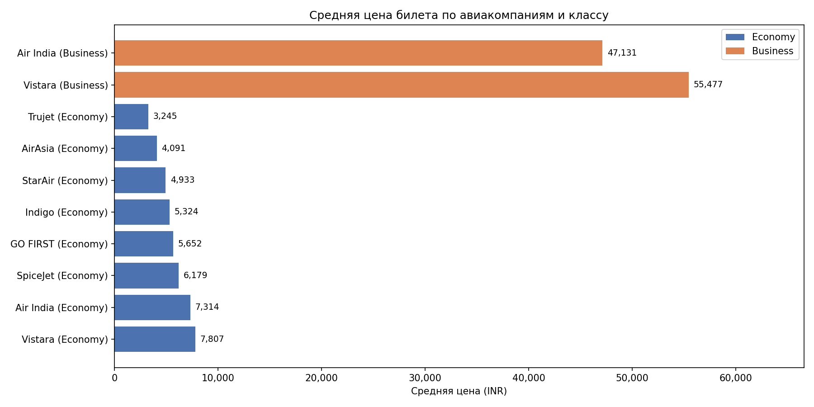
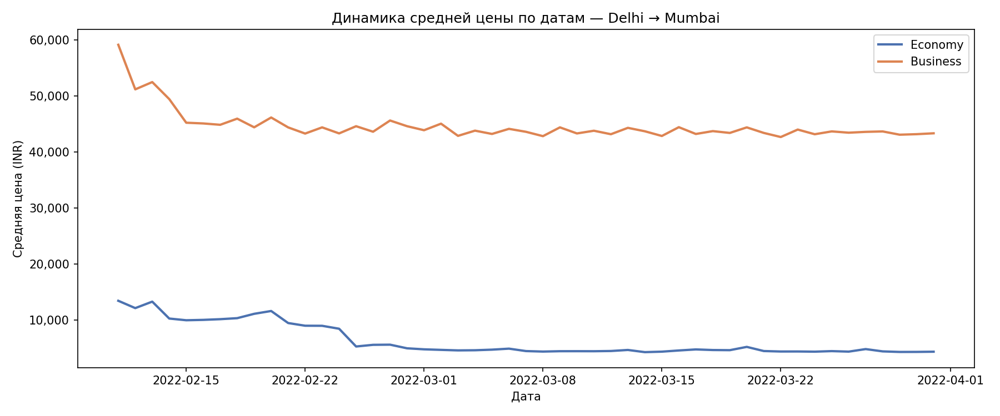
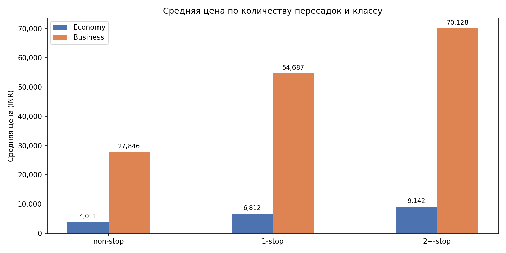
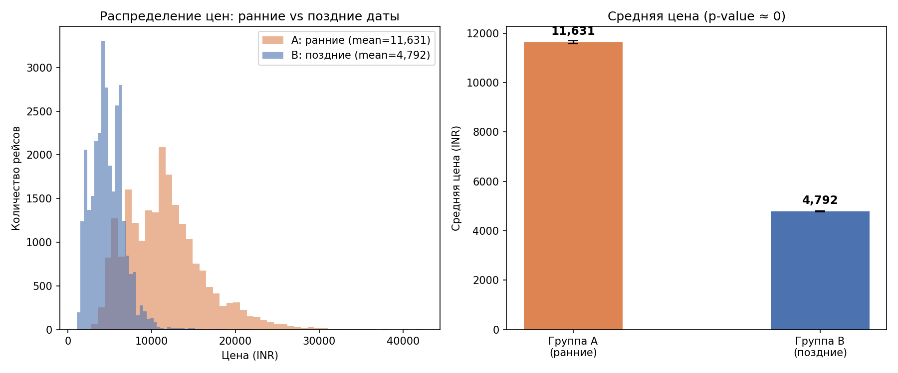

# Flight Demand Analysis

Анализ 300 000+ бронирований авиабилетов индийского рынка.  
Цель: выявить паттерны ценообразования и проверить гипотезу о влиянии глубины покупки на цену.

**Стек:** Python, pandas, matplotlib, scipy, SQL, SQLite, DBeaver

## Данные
- Источник: EaseMyTrip via Kaggle
- 300 261 записей, 12 колонок
- Период: февраль — март 2022
- Классы: Economy (206 774) и Business (93 487)

## Блок 1 — EDA

### Средняя цена по авиакомпаниям

Vistara — самая дорогая авиакомпания в обоих классах (бизнес 55 477 INR, эконом 7 807 INR).
Бизнес-класс в среднем в 7 раз дороже эконома.

### Динамика цен по датам (Delhi — Mumbai)

Цены в начале периода в 2-3 раза выше чем в середине.
Эконом падает с 13 000 до 5 000 INR, бизнес — с 60 000 до 43 000 INR.

### Цена и количество пересадок

Прямые рейсы дешевле рейсов с пересадками в 2.3 раза в экономе и в 2.5 раза в бизнесе.

## Блок 2 — SQL

- RANK — ранжирование авиакомпаний по цене внутри маршрута
- CTE + CASE WHEN — сегментация рейсов на бюджет, средний, премиум
- LAG — динамика изменения цены день к дню

## Блок 3 — A/B тест

Гипотеза: билеты в начале периода статистически дороже чем в конце.

- Группа A (11-17 февраля): средняя цена 11 631 INR, n=21 577
- Группа B (25-31 марта): средняя цена 4 792 INR, n=30 335
- t-статистика: 229.10
- p-value: 0.0000

Гипотеза подтверждена. Разница в 2.4 раза статистически значима.

## Итог

Оптимальное окно покупки билета — 3-5 недель до вылета.
Прямые рейсы выгоднее рейсов с пересадками несмотря на распространённый миф.
Vistara стабильно дороже бюджетных перевозчиков в 2 раза.
